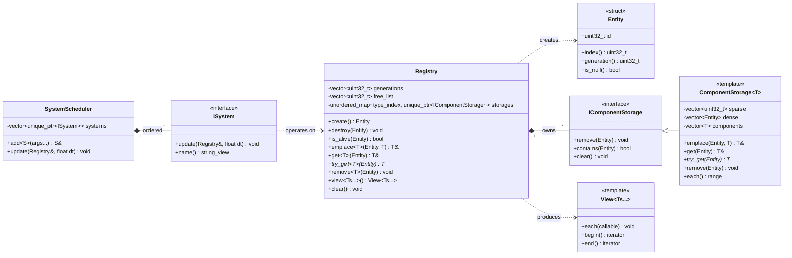
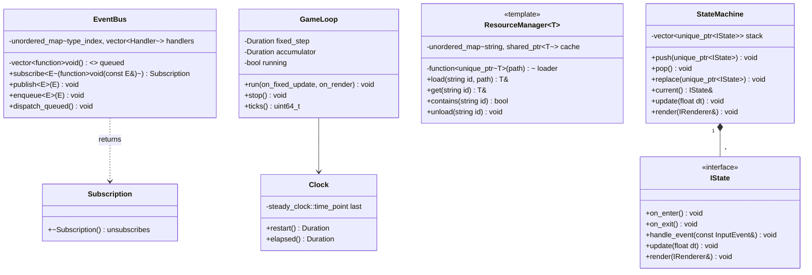
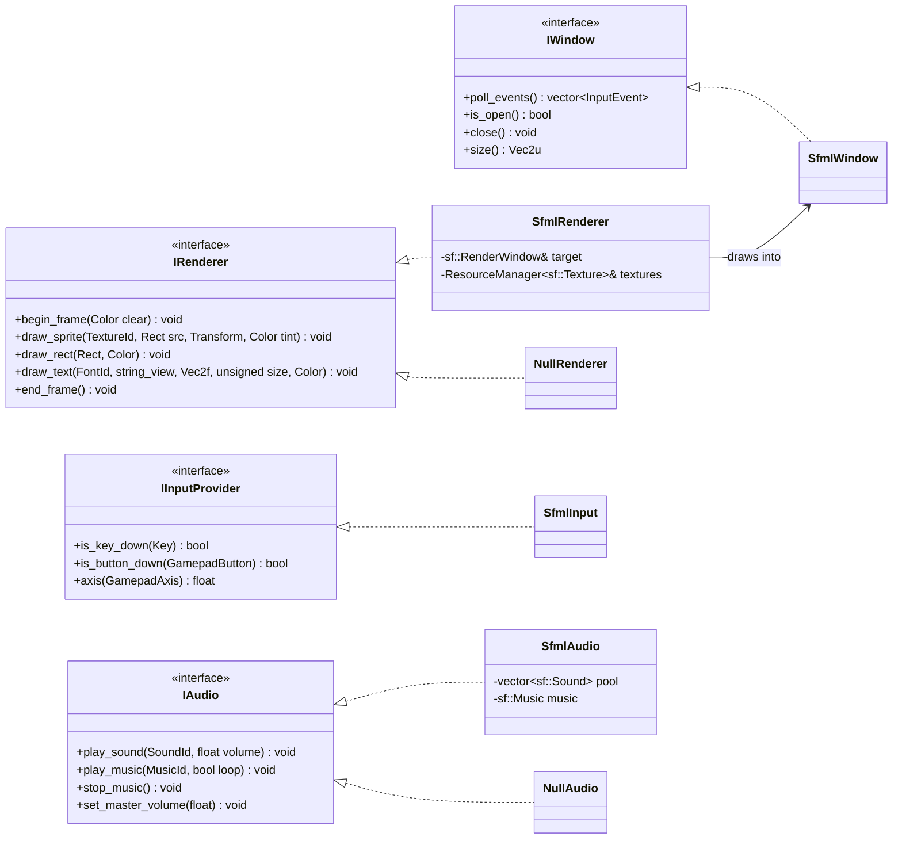
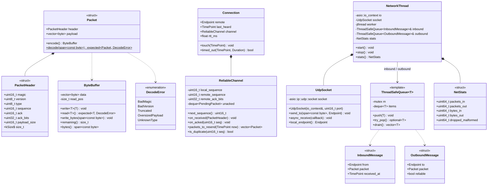
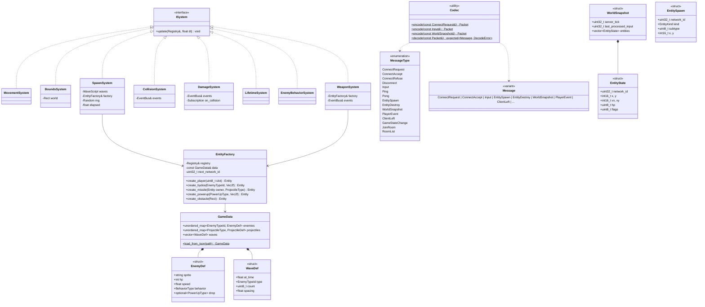
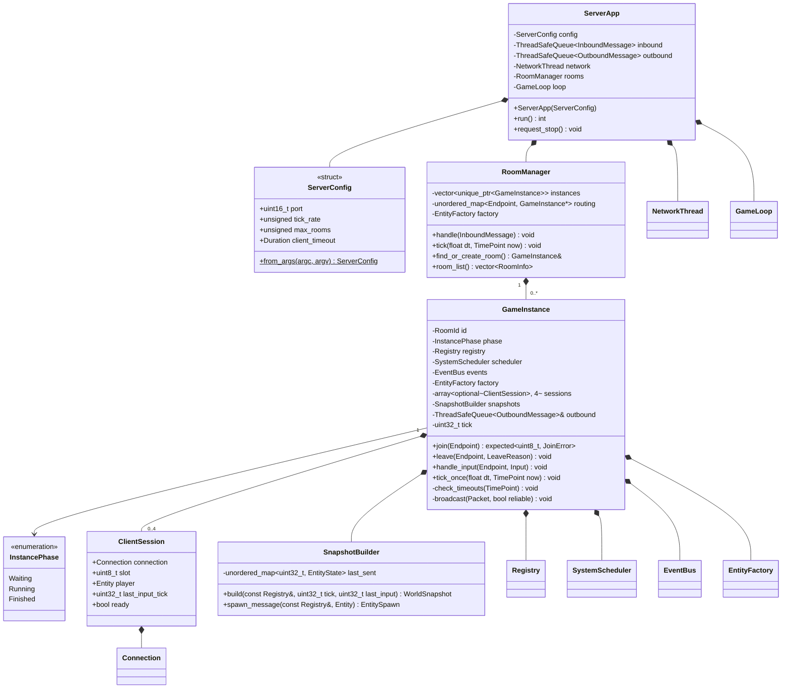
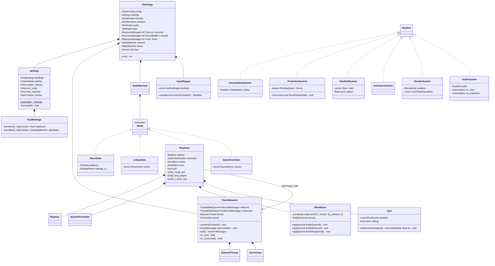
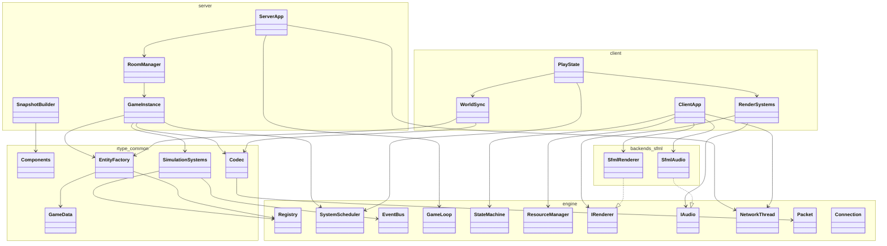

# N-Type — Class UML

Class-level view of the target architecture described in `ARCHITECTURE_PLAN.md`.
Diagrams are Mermaid `classDiagram` blocks (rendered by GitHub, MkDocs-material, VS Code).
Split per subsystem to stay readable; the last section shows how the pieces connect.

Legend: `<<interface>>` = pure virtual class, `<<struct>>` = plain data (component/message),
`<<template>>` = class template. Naming follows `ARCHITECTURE.md`
(`PascalCase` types, `snake_case` members).

---

## 1. Engine — ECS core (`ntype::engine::ecs`)

---

## 2. Engine — events, time, resources, scene

---

## 3. Engine — platform interfaces and SFML backend

---

## 4. Engine — networking (`ntype::engine::net`)

---

## 5. Shared game layer — components (`ntype::rtype`)

```mermaid
classDiagram
    direction LR

    class Transform {
        +Vec2f position
        +float rotation
        +Vec2f scale
    }
    class Velocity {
        +Vec2f linear
    }
    class Sprite {
        +TextureId texture
        +Rect source
        +int layer
        +Color tint
    }
    class Animation {
        +vector~Rect~ frames
        +float frame_time
        +float elapsed
        +size_t current
        +bool loop
    }
    class Collider {
        +Rect bounds
        +CollisionLayer layer
        +CollisionMask mask
    }
    class Health {
        +int current
        +int max
    }
    class Lifetime {
        +float remaining
    }
    class Weapon {
        +float cooldown
        +float since_last_shot
        +ProjectileType projectile
        +bool trigger_held
    }
    class Team {
        +TeamId id
    }
    class NetworkId {
        +uint32_t id
        +bool dirty
    }
    class PlayerInput {
        +InputBits bits
        +uint32_t client_tick
    }
    class Score {
        +uint32_t points
    }
    class EnemyBehavior {
        +BehaviorType type
        +float phase
        +Vec2f origin
    }
    class PowerUp {
        +PowerUpType type
    }
    class Player {
        +uint8_t slot
        +uint8_t lives
    }
```

All components are `<<struct>>` aggregates; no methods beyond trivial helpers.

---

## 6. Shared game layer — systems, factory, protocol

---

## 7. Server (`ntype::server`)

---

## 8. Client (`ntype::client`)

---

## 9. Cross-layer overview (who depends on whom)

Rules enforced by the CMake target graph:

- `ntype-engine` links only third-party libs (Asio; SFML only inside `ntype-engine-sfml`).
- `rtype_common` links `ntype-engine` — never SFML.
- `r-type_server` links `rtype_common` + `ntype-engine` (no SFML, `NullRenderer`/`NullAudio`).
- `r-type_client` links `rtype_common` + `ntype-engine` + `ntype-engine-sfml`.
- Nothing in `engine/` or `rtype_common/` includes a header from `server/` or `client/`.

---

## 10. Key design patterns used

| Pattern            | Where                                              |
|--------------------|----------------------------------------------------|
| Entity-Component-System | `Registry`, `ComponentStorage<T>`, `ISystem`   |
| Mediator / Observer| `EventBus` between systems, `AudioSystem` reacting to gameplay events |
| State              | `StateMachine` / `IState` (client screens, instance phases) |
| Factory            | `EntityFactory` + data-driven `GameData`           |
| Strategy (data)    | `EnemyBehavior.type` selects movement in `EnemyBehaviorSystem` (Lua later) |
| Producer/Consumer  | `ThreadSafeQueue` between network and game threads |
| RAII               | `UdpSocket`, `Subscription`, `NetworkThread` (`jthread`) |
| Adapter            | `Sfml*` backends implementing engine interfaces    |
| Snapshot / delta   | `SnapshotBuilder` (baseline for Part 2 delta compression) |
